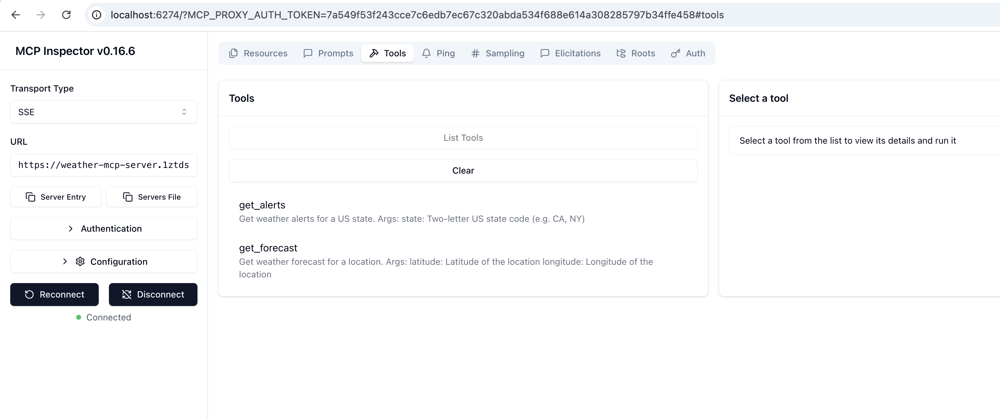
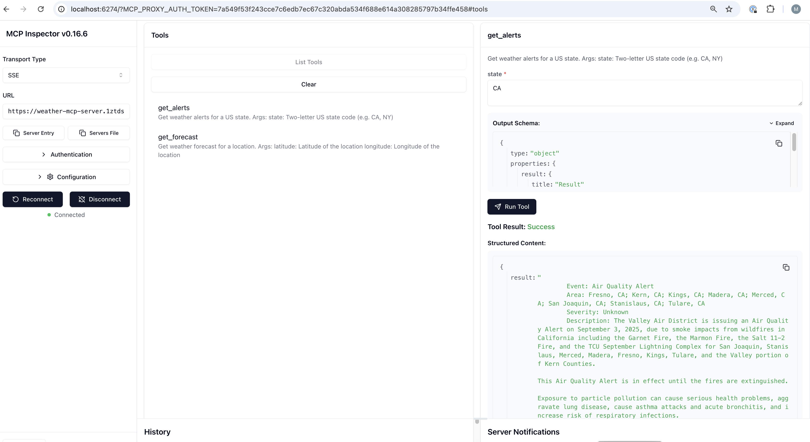
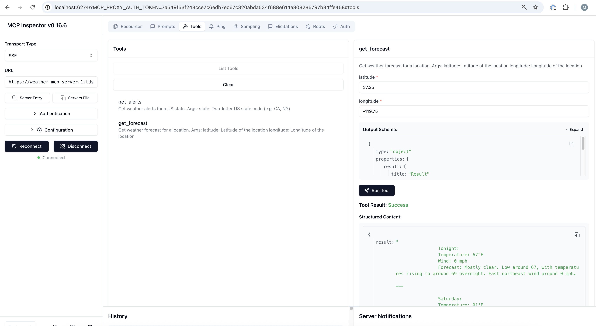

# IBM Cloud Code Engine Deployment Guide

This comprehensive guide provides detailed step-by-step instructions for deploying the Weather MCP Server to IBM Cloud Code Engine.

## Table of Contents

1. [Prerequisites](#prerequisites)
2. [Install IBM Cloud CLI](#step-1-install-ibm-cloud-cli)
3. [Install Required Plugins](#step-2-install-required-plugins)
4. [Login to IBM Cloud](#step-3-login-to-ibm-cloud)
5. [Set Target Region and Resource Group](#step-4-set-target-region-and-resource-group)
6. [Configure IBM Cloud Container Registry](#step-5-configure-ibm-cloud-container-registry)
7. [Build and Push Docker Image](#step-6-build-and-push-docker-image)
8. [Deploy to Code Engine](#step-7-deploy-to-code-engine)
9. [Verify Deployment](#step-8-verify-deployment)
10. [Test with MCP Inspector](#step-9-test-with-mcp-inspector)
11. [Troubleshooting](#troubleshooting)
12. [Monitoring and Management](#monitoring-and-management)
13. [Summary](#summary)

## Prerequisites

Before starting the deployment, ensure you have:

1. **IBM Cloud Account**: [Sign up here](https://cloud.ibm.com/registration) if you don't have one
2. **Container Runtime** (choose one):
   - **Docker Desktop**: [Download here](https://www.docker.com/products/docker-desktop/) (Recommended for beginners)
   - **Colima**: [Install via Homebrew](https://github.com/abiosoft/colima) - `brew install colima` (Lightweight alternative for macOS/Linux)
   - **Rancher Desktop**: [Download here](https://rancherdesktop.io/) (Open-source alternative with Kubernetes support)
3. **IBM Cloud CLI**: Will be installed in Step 1
4. **Local development environment** with:
   - Python 3.11+
   - Git
   - A terminal/command prompt

## Step 1: Install IBM Cloud CLI

### macOS/Linux
```bash
curl -fsSL https://clis.cloud.ibm.com/install/linux | sh
```

### Windows (PowerShell as Administrator)
```powershell
iex(New-Object Net.WebClient).DownloadString('https://clis.cloud.ibm.com/install/powershell')
```

### Verify Installation
```bash
ibmcloud --version
```

## Step 2: Install Required Plugins

```bash
# Install Code Engine plugin
ibmcloud plugin install code-engine

# Install Container Registry plugin  
ibmcloud plugin install container-registry
```

Verify the plugins are installed:
```bash
ibmcloud plugin list
```

## Step 3: Login to IBM Cloud

### Interactive Login
```bash
ibmcloud login
```

### API Key Login (Recommended for Automation)
```bash
ibmcloud login --apikey YOUR_API_KEY
```

To create an API key:
1. Go to [IBM Cloud Console](https://cloud.ibm.com)
2. Click on "Manage" → "Access (IAM)"
3. Select "API keys" → "Create an IBM Cloud API key"

## Step 4: Set Target Region and Resource Group

List available regions:
```bash
ibmcloud regions
```

Set your target region (e.g., us-south, eu-gb):
```bash
ibmcloud target -r us-south
```

List available resource groups:
```bash
ibmcloud resource groups
```

Set your resource group:
```bash
ibmcloud target -g YOUR_RESOURCE_GROUP
```

## Step 5: Configure IBM Cloud Container Registry

### 5.1 Login to Container Registry
```bash
ibmcloud cr login
```

### 5.2 Create a Namespace
```bash
# List existing namespaces
ibmcloud cr namespaces

# Create a new namespace (replace with a unique name)
ibmcloud cr namespace-add YOUR_NAMESPACE
```

Example:
```bash
ibmcloud cr namespace-add weather-mcp-dev
```

### 5.3 Get Registry Endpoint
```bash
ibmcloud cr region
```

Note the registry endpoint (e.g., `us.icr.io` for US South).

## Step 6: Build and Push Docker Image

### 6.1 Build Docker Image
```bash
# Get your registry endpoint
REGISTRY=$(ibmcloud cr region | grep -oE '[a-z]+\.icr\.io')
NAMESPACE="YOUR_NAMESPACE"  # Replace with your namespace

# Build the image
docker build -t ${REGISTRY}/${NAMESPACE}/weather-mcp-python:latest .
```

### 6.2 Push Image to Registry
```bash
docker push ${REGISTRY}/${NAMESPACE}/weather-mcp-python:latest
```

## Step 7: Deploy to Code Engine

### 7.1 Create Code Engine Project
```bash
# Create a new project
ibmcloud ce project create --name weather-mcp-project

# Select the project
ibmcloud ce project select --name weather-mcp-project
```

### 7.2 Deploy Application to Code Engine
```bash
ibmcloud ce app create \
  --name weather-mcp-server \
  --image ${REGISTRY}/${NAMESPACE}/weather-mcp-python:latest \
  --port 8000 \
  --env CODE_ENGINE=true \
  --cpu 0.25 \
  --memory 0.5G \
  --min-scale 0 \
  --max-scale 10
```

## Step 8: Verify Deployment

### 8.1 Get Application URL
```bash
ibmcloud ce app get --name weather-mcp-server --output json | jq -r '.status.url'
```

If you don't have `jq` installed:
```bash
ibmcloud ce app get --name weather-mcp-server
# Look for the URL in the output
```

### 8.2 View Application Logs
```bash
ibmcloud ce app logs --name weather-mcp-server --follow
```

## Step 9: Test with MCP Inspector

MCP Inspector is a powerful tool for testing and debugging MCP (Model Context Protocol) servers. It allows you to interactively explore your server's capabilities, test tools, and validate the implementation.

### 9.1 Install MCP Inspector

#### Option 1: Install via npm (Recommended)
```bash
npm install -g @modelcontextprotocol/inspector
```

#### Option 2: Use npx (No installation required)
```bash
npx @modelcontextprotocol/inspector
```

### 9.2 Get Your Server URL

First, get your deployed application URL:
```bash
APP_URL=$(ibmcloud ce app get --name weather-mcp-server --output json | jq -r '.status.url')
echo "Your MCP Server URL: ${APP_URL}"
```

### 9.3 Launch MCP Inspector

Start the MCP Inspector:
```bash
mcp-inspector
```

This will:
1. Start a local web interface (typically at `http://localhost:5173`)
2. Open your browser automatically
3. Present a connection interface

### 9.4 Connect to Your Deployed Server

In the MCP Inspector interface:

1. **Enter Server URL**: Use your deployed server's SSE endpoint:
   ```
   https://YOUR_APP_URL/sse
   ```
2. **Select Transport**: Choose "Server-Sent Events (SSE)"
3. **Click Connect**: The inspector will establish a connection

### 9.5 Expected Test Results

When testing with MCP Inspector, you should see:

1. **Server Initialization**: Successful handshake with protocol version confirmation
2. **Available Tools**:
   - `get_current_weather`: Get current weather conditions for a location
   - `get_weather_forecast`: Get weather forecast for specified days
3. **Tool Responses**: Valid weather data from the National Weather Service API
4. **Error Handling**: Proper error responses for invalid inputs

### 9.6 Interactive Testing with MCP Inspector

The MCP Inspector provides a comprehensive web-based interface for testing:

#### Connection Tab
- **Server Status**: Displays connection status and server information
- **Protocol Version**: Shows the MCP protocol version being used
- **Capabilities**: Lists server and client capabilities

#### Tools Tab  
- **Available Tools**: Browse all tools provided by your server
- **Tool Schemas**: View input parameters and expected outputs
- **Test Execution**: Run tools with custom parameters
- **Response Viewer**: See formatted tool responses



#### Testing Your Weather Tools

1. **Test get_alerts**:
   - Select the tool from the list
   - Enter a location (e.g., "CA")
   - Execute and view the weather data response



2. **Test get_weather_forecast**:
   - Select the tool from the list  
   - Enter latitude and longitude ( e.g. 37.25, -119.75)
   - Execute and view the forecast data. 



#### Debugging Features
- **Request/Response Log**: Monitor all MCP protocol messages
- **Error Handling**: View detailed error messages for failed requests
- **Performance Metrics**: Check response times and connection stability

## Troubleshooting

### Common Issues

#### Connection Refused
```bash
# Verify your app is running
ibmcloud ce app get --name weather-mcp-server

# Check app logs for errors
ibmcloud ce app logs --name weather-mcp-server --tail 20
```

#### App Not Responding
```bash
# Restart the application
ibmcloud ce app update --name weather-mcp-server --image ${REGISTRY}/${NAMESPACE}/weather-mcp-python:latest
```

#### Resource Constraints
```bash
# Scale up resources if needed
ibmcloud ce app update --name weather-mcp-server --cpu 0.5 --memory 1G
```

## Monitoring and Management

### Check Application Status
```bash
ibmcloud ce app get --name weather-mcp-server
```

### View Logs
```bash
ibmcloud ce app logs --name weather-mcp-server
```

### Update Application
After making changes, rebuild and redeploy:
```bash
# Rebuild image
docker build -t ${REGISTRY}/${NAMESPACE}/weather-mcp-python:latest .
docker push ${REGISTRY}/${NAMESPACE}/weather-mcp-python:latest

# Update the application
ibmcloud ce app update --name weather-mcp-server \
  --image ${REGISTRY}/${NAMESPACE}/weather-mcp-python:latest
```

### Scale Application
```bash
ibmcloud ce app update --name weather-mcp-server --min-scale 1 --max-scale 20
```

### Delete Application
```bash
ibmcloud ce app delete --name weather-mcp-server
```

### Delete Project (Clean Up)
```bash
ibmcloud ce project delete --name weather-mcp-project
```

## Summary

Congratulations! You have successfully completed the full deployment process:

### ✅ What You've Accomplished

1. **Environment Setup**
   - Installed and configured IBM Cloud CLI
   - Set up required plugins for Code Engine and Container Registry
   - Configured authentication and target settings

2. **Container Registry Configuration**
   - Created a namespace for your Docker images
   - Built and pushed your Weather MCP Server container

3. **Code Engine Deployment**
   - Created a Code Engine project
   - Deployed your application with proper configuration
   - Set up scaling and resource allocation

4. **Verification and Testing**
   - Verified deployment connectivity
   - Tested with MCP Inspector for full protocol validation
   - Confirmed weather tools are working correctly

5. **Operations Knowledge**
   - Learned monitoring and logging techniques
   - Understood update and scaling procedures
   - Know how to troubleshoot common issues

### 🚀 Your Weather MCP Server is Now Live

Your Weather MCP Server is now running on IBM Cloud Code Engine and ready for integration with:
- MCP-compatible AI applications
- Claude Desktop and other AI assistants
- Custom applications using the Model Context Protocol
- Development and testing workflows


## Additional Resources

- [IBM Cloud Code Engine Documentation](https://cloud.ibm.com/docs/codeengine)
- [Model Context Protocol Specification](https://modelcontextprotocol.io/docs)
- [MCP Inspector Documentation](https://github.com/modelcontextprotocol/inspector)
- [National Weather Service API](https://www.weather.gov/documentation/services-web-api)